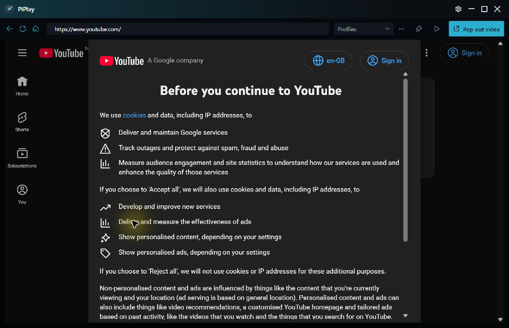

# Full Evaluation Report — Window frame and edges

- **Date:** 2026-08-29
- **Review type:** findings-first combined platform, product-design, accessibility-risk, and codebase-design audit
- **Surface:** current `main` HEAD `102314a`, limited to the custom-window-frame cluster and its tests
- **Spec source:** `docs/PiPlay_Product_Engineering_Spec.md`, especially Q-7 and sections 16, 20, 22, and 23
- **Standards sources:** `docs/AGENTS.md`, `docs/DECISIONS.md`, `docs/Theme_Preset_Differences.md`, repository code/tests, and current Microsoft platform guidance
- **Verdict:** **FAIL for frame-quality sign-off.** The frame is functional and well covered at the pure-policy/XAML level, but four medium interaction/platform findings, one medium visual-architecture problem, two lower-severity polish findings, and material native/deployed-evidence gaps remain.
- **Change attribution:** these issues pre-date the current 13-commit branch delta. The unrelated 47-file `origin/main...HEAD` delta and the pre-existing documentation-reduction worktree are not attributed here.

## Fresh visual evidence



1. **Source Window, normal state — needs work.** The title bar and toolbar are crisp, compact, and internally consistent. The browser is visibly recessed by the dark left/right/bottom acquisition band, however, so the shell reads as a frame around a tray rather than a borderless media surface. The Settings gear also reads as a fourth caption button because it is grouped directly with Minimize/Maximize/Close.

Evidence limit: this run captured and inspected the current Source Window only. Desktop automation stopped when external input was detected, so Popout and Settings visual states, hover/focus, alternate themes, maximize, and fractional-DPI rendering were not freshly captured. Screenshot evidence alone does not establish keyboard or assistive-technology behavior.

## Executive evaluation

PiPlay has a sound functional base: it keeps standard windowed WebView2, avoids transparent-window and click-through traps, uses PerMonitorV2, has owner-tuned 12-DIP edge and 96-DIP corner acquisition, separates much of the geometry into pure policies, and already handles many state, DPI, placement, opacity, and cleanup cases. The audit does not recommend replacing that foundation.

The sign-off failure comes from three related weaknesses:

1. **Native Windows contracts are incomplete.** Main does not expose `HTMAXBUTTON`; Player's upper button slice may fall back into `WindowChrome` resize handling; snap classification does not cover center columns or adjusted dividers.
2. **Frame lifecycle ownership is distributed.** XAML, static helpers, DWM/opacity code, region code, placement code, and per-window event handlers each own part of one state machine.
3. **The acquisition model leaks into presentation.** The proven resize target is rendered as a visible 12-DIP content inset, creating the dark tray visible in the Source capture.

There are no high-severity findings: no evidence shows data loss, security exposure, crash-on-entry, or universal inability to move/resize. The five medium findings still block frame-quality sign-off because they affect first-class Windows behavior, multi-monitor recovery, snap geometry, or the visible shell.

### Decision at a glance

| ID | Finding | Severity | Evidence confidence | Relative effort | Decision |
|---|---|---:|---|---:|---|
| F1 | Player caption-control top slice can fall into resize handling | Medium | Medium: static control flow; real Player HWND not yet confirmed | Small | Confirm with a failing real-window test, then fix before sign-off |
| F2 | Main omits native `HTMAXBUTTON` Snap Layout integration | Medium | High: source absence plus Microsoft contract | Medium | Implement for Source; preserve WPF click/keyboard/UIA behavior |
| F3 | Snap-like geometry misses center and adjusted layouts | Medium | High for policy false negatives; runtime visual result uncaptured | Medium | Bias uncertain snap geometry toward square corners |
| F4 | Settings clamps to the primary monitor before Owner exists | Medium | High for ordering/API mismatch; field manifestation uncaptured | Medium | Resolve owner monitor after HWND/ownership exists |
| F5 | Native acquisition target and visible WebView inset are coupled | Medium design debt | High: source, history, tests, and fresh screenshot agree | Large/R&D | Keep 12/96 now; decouple only through a bounded native spike |
| F6 | Maximized windows retain floating-only right/edge residue | Low | High static; maximized capture missing | Small | Collapse residue only while maximized |
| F7 | Popout density and action wording drift from shared contracts | Low | High static, except keyboard focus remains unobserved | Small | Normalize tokens, next-action labels, and visual grouping |

### Recommended decision

Use a **contract-first hybrid path**:

1. Characterize and repair F1–F4 without changing the proven 12/96 acquisition geometry.
2. Land the contained maximized-state, density, tooltip, UIA, and grouping polish.
3. Extract one deep `WindowFrame` module around the now-passing behavior.
4. Run the zero-to-one-DIP native edge-acquisition spike behind that interface.
5. Add an opt-in deployed frame smoke and complete the visual/DPI/High Contrast matrix.

This order pays down known correctness risk before taking on the less predictable child-HWND edge experiment.

## Evaluation method

### Severity

- **High:** data loss, security/privacy harm, crash, inaccessible critical action, or a frame failure affecting nearly all users.
- **Medium:** material platform-contract, interaction, monitor/DPI, snap, or visible-shell defect that should block frame-quality sign-off.
- **Low:** bounded inconsistency or polish debt with a clear workaround and no evidence of task failure.

### Evidence confidence

- **High:** directly established by current source, tests, official platform contract, or the accepted current-build screenshot.
- **Medium:** strong static path with a remaining real-HWND or visual confirmation gate.
- **Low:** hypothesis only; no finding in this report relies solely on low-confidence evidence.

### Effort

Effort is deliberately relative, not a calendar estimate:

- **Small:** localized XAML/code/test change.
- **Medium:** native message or monitor/DPI behavior plus real-HWND coverage.
- **Large/R&D:** child-HWND acquisition work requiring prototypes and playback/input validation.

## Surface-by-surface health

1. **Source Window, normal — needs work.** Current Debug capture is readable and coherent, but the browser is visibly recessed and Settings is grouped like a system caption control.
2. **Source Window, maximized — not freshly verified.** Static source shows the WebView inset collapses, while the caption right reservation remains.
3. **Popout, normal/maximized/snapped — not freshly verified.** Source and tests expose material caption, region, density, and full-bleed risks.
4. **Settings, Source-owned and Popout-owned — not freshly verified.** Static ordering shows primary-monitor bounds are chosen before the real owner is assigned.
5. **Hover, pressed, keyboard focus, UI Automation, High Contrast, and 100/125/150% DPI — partially covered or not run.** These require interaction/runtime evidence; screenshot review alone cannot certify them.

## Strengths worth preserving

- Standard windowed WebView2 and `AllowsTransparency=False` preserve video, DRM, input, and HwndHost compatibility.
- The 12-DIP edge and 96-DIP corner targets were restored after direct fractional-DPI acquisition testing; they are intentional usability values, not accidental padding.
- `BorderlessResizeHitTestPolicy`, `RoundedWindowRegionPolicy`, and `PlacementMath` already demonstrate the value of pure geometry.
- Popout full-monitor maximize is explicit and internally consistent; it must remain distinct from Source work-area maximize.
- The custom region has stale-region cleanup logic, and native callbacks contain managed exceptions where currently implemented.
- High Contrast intentionally restores the system border instead of suppressing an important boundary cue.
- Main and Player already keep `AllowsTransparency=False`, `UseLayoutRounding=False`, and native placement/DPI behavior aligned with the product specification.

## Findings

### 1. Medium — the top slice of Popout caption controls may fall into resize handling

`BorderlessWindowHelper.cs:314-317` detects an enabled `ButtonBase` and falls through so the control can win. WPF `WindowChrome` then still owns the 12-DIP top resize border from `PlayerWindow.xaml:19-24`. Main opts its caption stack back into client hit testing at `MainWindow.xaml:63-64`; Player's stack at `PlayerWindow.xaml:58-78` omits `WindowChrome.IsHitTestVisibleInChrome="True"`.

The 30-DIP buttons are centered in a 44-DIP strip, putting their top five DIPs inside that resize band. Static control-flow analysis therefore leaves `WindowChrome` authoritative over that slice; the expected symptom is a resize cursor or resize gesture when the user targets the upper edge of Settings, Fade, Pin, Expand, or Close. This review did not independently reproduce that coordinate path at runtime, so the recommended real-`PlayerWindow` test is also the confirmation gate.

Recommendation: add the attached hit-test property to the Player control container. Add a real-`PlayerWindow` `WM_NCHITTEST` test over the top slice of a button, plus controls for a passive top edge and the reserved top-right corner. Existing `WpfRuntimeTests.cs:645-685` exercises only a synthetic empty window.

**Evaluation:** the affected strip is narrow but spans all five Popout caption controls and sits on a high-value close/restore surface. Because the controller did not independently reproduce it, this remains a medium-confidence blocker rather than a confirmed runtime defect.

**Ways forward:**

- **Smallest correction:** apply `WindowChrome.IsHitTestVisibleInChrome="True"` to the Player caption-control container, matching Main.
- **Long-term correction:** let the consolidated frame Module return `HTCLIENT` explicitly over registered client controls instead of relying on fall-through ordering between two native handlers.
- **Do not:** shrink or disable the top resize band globally; that would trade a suspected button defect for a known acquisition regression.

**Acceptance gate:** on a real `PlayerWindow`, the upper and center slices of each caption control activate the same WPF command; a passive top-edge coordinate returns `HTTOP`; the reserved outer corner returns `HTTOPRIGHT`; keyboard/UIA invocation remains unchanged.

### 2. Medium — Main's custom Maximize button does not expose the Windows 11 Snap Layout menu

Main disables system caption buttons (`MainWindow.xaml:20-23`) and renders its own Maximize button (`MainWindow.xaml:70-71`). The only `WM_NCHITTEST` implementation in `BorderlessWindowHelper.cs:248-317` returns resize codes; the codebase contains no `HTMAXBUTTON` path.

Microsoft's desktop guidance says a custom title bar must return `HTMAXBUTTON` over its maximize/restore control for the hover Snap Layout menu. It also confirms that current layouts include three side-by-side zones. See [Support snap layouts for desktop apps on Windows 11](https://learn.microsoft.com/en-us/windows/apps/desktop/modernize/ui/apply-snap-layout-menu).

Recommendation: make the frame helper own the Maximize element's native hit rectangle and return `HTMAXBUTTON`, while retaining click, keyboard, and tooltip behavior. Add a real-HWND hit-test around the button and an interactive Windows 11 smoke for hover/click/restore.

**Evaluation:** this is a deterministic platform-contract omission, not a visual preference. The window can still maximize and users can invoke Snap with `Win+Z`, so severity is medium rather than high; the missing hover affordance nonetheless makes the custom frame feel non-native.

**Ways forward:**

- **Recommended:** register Main's Maximize element with the native hit-test owner, maintain a DPI-aware rectangle, and route native pointer activation into the same maximize/restore command used by WPF.
- **Possible but disproportionate:** restore system-drawn caption buttons or migrate the whole title-bar stack to Windows App SDK windowing. Either would change PiPlay's current WPF frame and visual contract.
- **Profile boundary:** do not automatically give Popout's Expand control Source semantics. Popout deliberately expands to the full monitor, while Source maximizes to the work area.

**Acceptance gate:** hovering Main's Maximize/Restore control opens the Windows 11 Snap Layout menu; pointer click, Space/Enter, UIA Invoke, maximize/restore glyph, tooltip, and work-area geometry all remain coherent at 100/125/150% DPI.

### 3. Medium — valid snapped Popouts can retain the custom rounded region

`RoundedWindowRegionPolicy.cs:69-73` requires contact with a left or right work-area edge before checking its allowed width fractions at `:80-89`. A full-height center third `(640,0)-(1280,1040)` in a `1920x1040` work area therefore returns false, even though three-column Snap Layouts are supported. User-adjusted snap-group dividers such as 55/45 also fall outside the hard-coded fractions.

`PlayerWindow.xaml.cs:1200-1225` then treats the Popout as floating and retains/reapplies its 22-DIP HRGN, contrary to `docs/DECISIONS.md:35` (snap clears the region). `RoundedWindowRegionPolicyTests.cs:72-88` covers only outer-edge half/quarter/third arrangements.

Microsoft's current Windows 11 guidance also states that snapped and maximized windows are not rounded by design. See [Apply rounded corners in desktop apps](https://learn.microsoft.com/en-us/windows/apps/desktop/modernize/ui/apply-rounded-corners).

Recommendation: classify a work-area-contained, full-height window as snap-like regardless of horizontal fraction; classify edge-aligned half-height tiles conservatively as snap-like even after divider adjustment. Square corners are safer than clipped content at a snap seam. Add center-third, adjusted-divider, negative-monitor-origin, and event-driven HRGN clear/restore cases.

**Evaluation:** the false negative is directly reproducible at the pure-policy interface. The visible result still needs a real snapped Popout capture, but the policy contradicts ADR-0008's “snap clears it” contract. False positives merely remove rounding from a corner-parked window; false negatives can clip child-HWND content at a tiling seam. The safe bias is therefore square.

**Ways forward:**

- **Recommended heuristic:** any work-area-contained full-height column is snap-like regardless of x-edge contact or width fraction; keep tolerant corner/half-height classification without requiring fixed horizontal fractions.
- **Conservative fallback:** treat ambiguous edge-aligned tiling geometry as snap-like and accept occasional square floating corners.
- **Do not claim an exact snapped-state API:** ordinary top-level HWNDs do not expose a public Boolean that solves this policy directly.

**Acceptance gate:** center-third, center-half, 55/45 and 45/55 full-height splits, adjusted quadrant widths, tolerance drift, negative monitor origins, and floating negatives pass. A real Round Popout clears HRGN after OS snap/move-size exit and reapplies it after floating restore.

### 4. Medium — Settings bounds are calculated from the primary monitor before Owner exists

Settings uses `CenterOwner` (`SettingsWindow.xaml:10`) but calls `ApplyInitialBounds` in its constructor (`SettingsWindow.xaml.cs:104-110`). That method reads primary-monitor-only `SystemParameters.WorkArea` (`SettingsWindow.xaml.cs:178-187`); Main assigns the actual Source or Popout owner only afterward (`MainWindow.xaml.cs:904-923`). The test at `WpfRuntimeTests.cs:1481-1493` pins the primary-monitor formula instead of exercising owner-monitor behavior.

On a shorter or higher-DPI secondary owner monitor, the fixed 680-DIP dialog can touch the taskbar or place footer actions outside the work area. See Microsoft's [`SystemParameters.WorkArea` documentation](https://learn.microsoft.com/en-us/dotnet/api/system.windows.systemparameters.workarea?view=windowsdesktop-10.0).

Recommendation: resolve the owner HWND's monitor/work area after ownership and source initialization, then reclamp after DPI/monitor moves. Put the geometry in a pure policy with unequal-monitor and unequal-DPI tests.

**Evaluation:** the constructor ordering and primary-monitor API are confirmed. The practical defect appears only when the owner's monitor has a smaller logical work area or different DPI, so the impact is conditional but can make footer actions hard to reach.

**Ways forward:**

- **Recommended:** defer bounds reconciliation until `SourceInitialized`/Loaded, resolve `Owner`'s HWND with `MonitorFromWindow` and `GetMonitorInfo`, convert physical work-area geometry at the relevant DPI, then center and clamp.
- **Secondary safeguard:** reclamp after Settings crosses monitors or receives a DPI change.
- **Do not preserve the current test as the contract:** replace the primary-`SystemParameters.WorkArea` assertion with owner-monitor cases.

**Acceptance gate:** Source-owned and Popout-owned dialogs remain fully inside shorter, taller, negative-origin, and unequal-DPI work areas; the footer remains keyboard reachable; dragging between monitors reclamps without a jump loop.

### 5. Medium design debt — resize acquisition and visible content inset are one setting

The owner-tested acquisition target is deliberate: `BorderlessResizeHitTestPolicy.cs:9-10` defines 12-DIP edges and 96-DIP corner reach because smaller targets were difficult at fractional DPI. But Main and Player turn that native target directly into visible WebView margin (`MainWindow.xaml:217-225`, `PlayerWindow.xaml:109-117`), and Focused Popout makes it four-sided (`PlayerWindow.xaml.cs:937-951`). `XamlInvariantTests.cs:60-78` locks the visual margin to the native policy value.

That coupling is the visible dark tray in the fresh screenshot. It also recreates a known trade-off: commit `1a234d0` recorded that a 10-DIP inset read as a tray and reduced it to 4 DIP; commit `d682961` later restored 12/96 after direct acquisition testing. The right outcome is not to shrink the hit target blindly, but to make acquisition independent from presentation.

Recommendation: run a bounded native spike using standard windowed WebView2 with same-process edge HWNDs or child-HWND resize forwarding. Acceptance is 12/96 acquisition at 100/125/150% DPI with a zero-to-one-DIP visual seam, no swallowed web clicks, and unchanged playback/focus. Do not default to `WebView2CompositionControl`: Microsoft documents lower frame rates and failure of DRM-protected playback, which is a poor fit for PiPlay. See [WebView2 in WPF apps](https://learn.microsoft.com/en-us/microsoft-edge/webview2/platforms/wpf) and the [composition-control API notes](https://learn.microsoft.com/en-us/dotnet/api/microsoft.web.webview2.wpf.webview2compositioncontrol).

**Evaluation:** this is the most visible issue and the most technically uncertain fix. The screenshot, XAML, tests, and commit history all confirm the coupling. Commit `1a234d0` reduced a tray-like inset; `d682961` restored 12/96 because direct acquisition mattered. A cosmetic reduction without a new acquisition mechanism would repeat that failed trade.

**Ways forward:**

- **Keep and style:** retain the 12-DIP owned band but make it visually intentional. Lowest risk, but it cannot deliver a genuinely borderless media surface.
- **Child-HWND forwarding:** identify the WebView2 descendant HWND and forward qualified edge gestures into top-level native resize. Best chance of zero visible inset; highest message-routing and focus risk.
- **Same-process edge HWNDs:** reserve transparent/native edge hit targets independent of WPF/WebView layout. Potentially robust, but adds z-order, DPI, lifecycle, and accessibility complexity.
- **Composition hosting:** visually convenient but rejected as the default because Microsoft's current WPF documentation warns of lower frame rates and DRM-protected playback failure.

**Acceptance gate:** all eight resize directions remain easy to acquire at 100/125/150% DPI; corner reach remains 96 DIP along the edge, not a content-stealing square; normal content has no more than a one-DIP intentional seam; no YouTube clicks, focus, keyboard, playback, DRM, hover/fade, or drag behavior regresses.

### 6. Low — maximized state keeps floating-only frame residue

The 12-DIP caption-stack right margin remains in maximized Main and Player (`MainWindow.xaml:63`, `PlayerWindow.xaml:58`) even though resize hit testing is disabled outside normal state. Close therefore never reaches the top-right screen corner. Player also retains its one-DIP `PopoutEdgeBorder` (`PlayerWindow.xaml:27-30`) when the WebView margin becomes zero, so "full bleed" remains inset.

Recommendation: preserve the owner-tested 12-DIP right reservation only while floating; collapse it, and the Popout accent edge, while maximized. Pin both state transitions in WPF tests.

**Evaluation:** the residue is small and limited to maximized state, but it weakens Fitts's-law access to Close and contradicts the stated full-bleed intent. It is a contained polish fix, not a reason to alter normal-state acquisition.

**Acceptance gate:** floating retains the reserved top-right diagonal target; maximized Close reaches the screen corner on Source and Popout; Player's accent edge becomes zero while maximized and restores exactly once on return to normal.

### 7. Low — frame controls drift in density and action wording

- Player hard-codes every chrome button to `30x30` (`PlayerWindow.xaml:59-76`, plus error close at `:102-103`), overriding the shared 30/32/36-DIP theme token consumed by `ControlStyles.xaml:134-136,204-206` and defined by `ThemeCatalog.cs:164-178`.
- Main changes the Maximize glyph but leaves its tooltip permanently "Maximize" (`MainWindow.xaml:70-71`, `MainWindow.xaml.cs:132-133`); Player correctly changes both.
- Settings' X says only "Close settings" even though it cancels previewed changes, and Popout Close's accessible name omits the return-video consequence.

Recommendation: let shared styles size Popout controls, update Main to "Restore" while maximized, and make destructive/cancel/return consequences explicit in tooltip and UI Automation names. Visually separate Settings from the three window controls with a small spacer or divider.

**Evaluation:** these are low-risk consistency and accessibility-language improvements. The controls remain operable, but Soft Glass/Minimal do not receive their intended density, Main exposes stale action text after maximize, and two close actions under-describe their consequences.

**Acceptance gate:** Popout chrome consumes the shared 30/32/36-DIP icon-size token; the 44-DIP strip fits every theme; Main's tooltip tracks Maximize/Restore; Settings announces cancellation; Popout Close announces return behavior; visible focus and pressed states are confirmed rather than inferred.

## Cross-cutting root causes

### Two native hit-test authorities

PiPlay's comctl32 subclass computes expanded resize hit codes, then falls through to WPF `WindowChrome`, which has its own non-client policy. The intended precedence is not represented once. F1 and F2 are both consequences: client controls are inferred rather than explicitly returned, and the custom Maximize control is invisible to native caption semantics.

### No single lifecycle owner

Main installs maximize and resize separately. Player coordinates state, size, location, DPI, move/size exit, source initialization, DWM appearance, custom HRGN, focused inset, and placement across several handlers. Settings computes bounds before the owner exists. Each piece is locally reasonable, but their ordering is a caller-owned protocol.

### Acquisition and presentation share one value

`ResizeBorderDip` is simultaneously an interaction target, a `WindowChrome` setting, a WebView margin, a corner reservation, and a focused four-sided inset. One owner-tuned input value therefore determines the shell's visible composition.

### Tests emphasize decisions more than event wiring

Pure-policy and XAML tests are strong, but several tests invoke the desired method directly or inspect internal bookkeeping. They prove calculations and local effects, not always that the OS/WPF event sequence calls them at the right time or that the resulting HWND state matches.

## Coverage assessment

Focused verification was rerun on the current working tree while preparing this expanded report:

- `134/134` resize-helper, rounded-region, and XAML invariant tests.
- `138/138` WPF runtime tests.

Those green checks do not cover several native lifecycle boundaries:

- `WpfRuntimeTests.cs:1790-1825` manually calls `ApplyCornerAppearance`, so it does not prove that real resize/DPI/snap events refresh or clear the HRGN.
- DWM corner/border calls discard their result and tests read internal bookkeeping rather than `DwmGetWindowAttribute` (`WindowOpacityApplier.cs:126-170`). High Contrast is sampled only when an appearance write occurs; no live false→true→false transition is covered.
- Placement tests exercise `PlacementMath`, not native capture/restore and monitor API failure paths.
- The current UI-smoke lane observes five Source controls and a Source screenshot but never opens a Popout. It cannot certify Popout resize hit codes, region clearing, maximize/restore, or DPI refresh.

Minimum release addition: an opt-in frame smoke using isolated Round settings that opens the second HWND, captures normal/maximized/restored states, probes passive edges and caption controls, and reports multi-DPI as `PASS`, `FAIL`, or explicit `NOT RUN`.

The full `scripts/Test-LocalCI.ps1` gate was not rerun because this change is a documentation expansion and the focused 272-test frame surface is the proportional gate. Any implementation pass must run the canonical full gate.

### Required verification ladder for implementation

1. **Pure contracts**
   - Player caption precedence geometry.
   - Source maximize hit rectangle.
   - center/adjusted snap classification.
   - owner-monitor Settings clamp.
   - profile-specific state transitions and failure fallbacks.
2. **Real WPF/HWND integration**
   - `WM_NCHITTEST` over caption controls, passive edges, corners, and Maximize.
   - event-driven state/size/location/DPI/move-exit HRGN behavior.
   - DWM HRESULT capture/readback and High Contrast transition.
   - native monitor/placement failure injection where feasible.
3. **Opt-in deployed smoke**
   - launch isolated Source, open a real Popout, open Settings from each owner.
   - capture normal, maximized, restored, and snapped states.
   - report each requested DPI/monitor state as `PASS`, `FAIL`, or `NOT RUN`.
4. **Manual owner acceptance**
   - Snap Layout hover and selection.
   - all edges/corners at fractional DPI.
   - Tab, Space/Enter, Escape, visible focus, and UIA action wording.
   - playback, DRM, focus, and click behavior after any native-edge experiment.

## Deep-module recommendation

Frame ownership is split across `BorderlessWindowHelper`, `RoundedWindowRegionPolicy/Applier`, the DWM methods hidden inside `WindowOpacityApplier`, `WindowPlacementService`, XAML `WindowChrome`, and repeated per-window event choreography. Player alone coordinates source initialization, state, size, location, DPI, move/size exit, and retry behavior across `PlayerWindow.xaml.cs:195-226,1133-1226`.

Replace that distributed protocol with one concrete deep module rather than a facade over the current statics.

### Architecture alternative A — explicit small session

```csharp
_frame = WindowFrame.Attach(
    this,
    FrameProfiles.Source,
    new FrameBindings(TitleBar, Browser, MaximizeButton),
    new FrameState(SourceFrameAppearance(), _settings.MainWindow.Placement));

_frame.Update(nextFrameState);
_settings.MainWindow.Placement = _frame.Snapshot.Placement;
```

The external Interface is `Attach`, complete-state `Update`, and a read-only `Snapshot`; teardown is automatic and idempotent, with `Dispose` retained for tests or early shutdown. The Module refreshes the cached placement after restore, settled moves/resizes, DPI reconciliation, and in its earlier `Closing` handler. Reading `Snapshot.Placement` performs no native query, so callers do not choose capture timing. Closed `Source`, `Popout`, and `Dialog` profiles prevent callers from mixing work-area maximize, full-monitor expand, resize, owner bounds, and HRGN behavior.

**Strengths:** compile-time element references, explicit ownership, small caller surface, complete-state updates that avoid partial ordering, and enough depth to hide the full native lifecycle.

**Weaknesses:** `FrameState` and `FrameBindings` must stay small or the Interface becomes a configuration bag; the implementation must be kept strictly to top-level frame behavior.

### Architecture alternative B — XAML attached Interface

```xml
<Window frame:WindowFrame.Profile="Source"
        frame:WindowFrame.Appearance="{Binding SourceFrameAppearance}">
  <Grid frame:WindowFrame.Part="DragSurface" />
  <Button frame:WindowFrame.Part="MaximizeControl" />
  <wv2:WebView2 frame:WindowFrame.Part="WindowedWebContent" />
</Window>
```

The Module discovers semantic frame parts, creates a private controller, owns all event/native ordering, and exposes placement through a two-way attached property.

**Strengths:** the common caller is almost declarative; window code-behind no longer calls attach, subscribes to lifecycle events, or disposes anything.

**Weaknesses:** missing/duplicate roles become runtime initialization errors; native-critical wiring is less discoverable; two-way placement and appearance attached properties add hidden behavior. This is an attractive convenience layer later, not the safest first seam.

### Architecture alternative C — compiled capability graph

This design composes facets such as resize acquisition, caption hit testing, maximize extent, placement, owner bounds, DWM appearance, rounded regions, and native-child presentation. A compiler rejects duplicate native-resource ownership, missing requirements, and cycles.

**Strengths:** maximum extension, explicit capability/resource conflicts, and good support for future frame experiments.

**Weaknesses:** callers and maintainers must learn facets, phases, capabilities, compiler errors, and a broader Interface. With only Source, Popout, and Dialog, it solves a possible future product rather than today's codebase.

### Architecture comparison

| Alternative | Depth | Caller simplicity | Compile-time clarity | Extension cost | Fit for PiPlay now |
|---|---|---|---|---|---|
| A. Explicit fixed-profile session | High | High | High | Moderate | **Best** |
| B. Attached XAML Interface | High internally | Highest | Medium/low | Moderate | Good later convenience |
| C. Capability graph | High runtime, shallower definition surface | Low | High after compilation | Lowest for many variants | Too much machinery today |

### Recommended target

Choose **Alternative A**, borrowing two ideas from the others:

- use closed, centrally owned profiles rather than public behavior flags;
- model internal behavior as state reconciliation and typed effects, so WPF event order is not encoded across callers.

`WindowFrame` should own initialization, one native subclass, resize hit testing, native caption hit codes, state/size/location/DPI/move-size/High Contrast/destruction events, DWM appearance, custom-region policy, owner-monitor dialog bounds, and the timing of placement restore/capture. `WindowPlacementService` can retain persisted data and pure `PlacementMath`, but callers should no longer coordinate native timing.

The Interface invariants should be explicit:

- attach once, on the owning Dispatcher, after `InitializeComponent` and before `SourceInitialized`;
- registered elements belong to that Window;
- Source maximizes to work area, Popout expands to full monitor, Dialog is non-resizable;
- 12-DIP edge and 96-DIP corner acquisition are internal product constants, not profile knobs;
- enabled Maximize wins as `HTMAXBUTTON`, other enabled client controls win as `HTCLIENT`, resize edges precede drag surfaces;
- Round HRGN belongs only to a floating Round Popout; maximize/snap clears it;
- native callback failures never unwind through Win32 and always produce a typed diagnostic plus a safe fallback;
- High Contrast is observed live, not sampled only when another appearance write happens;
- cleanup is idempotent on `Closed` and `WM_NCDESTROY`.

Use one package-internal `IFrameNative` seam with two justified adapters: `Win32FrameNative` in production and `FakeFrameNative` in deterministic tests. Keep WPF itself direct; real-HWND tests remain necessary. Split whole-window alpha into an alpha-only Module and move DWM corner/border behavior into the frame Module so `WindowOpacityApplier` no longer owns unrelated effects.

The native edge-acquisition strategy must remain hidden behind this Interface. Start with the legacy inset fallback; switch to child-HWND forwarding or edge HWNDs only after the spike passes. Callers must never choose composition hosting or “zero inset” as an unverified option.

## Non-findings and boundaries

- Player's full-monitor maximize is an explicit product decision at `PlayerWindow.xaml.cs:831-834`; do not add Main's work-area maximize hook to it.
- Curve-following outer border/shadow styling is explicitly deferred in `docs/PiPlay_Product_Engineering_Spec.md:214` and `docs/DECISIONS.md:35`; it is not a defect in this review.
- No product source was edited. The review adds only this report and its fresh evidence image; the pre-existing dirty documentation-reduction worktree was preserved.

## Recommended order

1. Lock and fix the Player button hit-test, `HTMAXBUTTON`, center/adjusted snap classification, and owner-monitor Settings clamp.
2. Fix maximized residue, density, tooltip, and UIA wording.
3. Extract `WindowFrame` around those passing contracts.
4. Run the native edge-acquisition spike; keep 12/96 unless live owner testing approves a fallback.
5. Add the opt-in deployed frame smoke and capture Source/Popout/Settings across themes, normal/maximized, focus/hover, and 100/125/150% DPI.

## Ways forward

### Path 1 — correctness patch only

Implement F1–F4 plus the small F6/F7 polish, retain the current 12-DIP visible inset, and stop.

**Advantages:** fastest route to native caption, snap, monitor, and wording correctness; small diff; easiest rollback.

**Disadvantages:** lifecycle ownership stays distributed; the dark tray remains; future frame changes continue to require coordinated edits across helpers, XAML, and windows.

**Use when:** near-term stability matters more than resolving the visible frame architecture.

**Evaluation:** acceptable as an interim release step, not a final frame-quality solution.

### Path 2 — visual/native edge spike first

Prototype child-HWND forwarding or same-process edge HWNDs before fixing the known findings.

**Advantages:** attacks the most visible issue immediately and may clarify the final presentation model.

**Disadvantages:** highest platform uncertainty; can consume time on focus/input/DRM behavior while confirmed caption, snap, and owner-monitor gaps remain.

**Use when:** only as an isolated research branch with a strict fallback.

**Evaluation:** not recommended as the first implementation pass.

### Path 3 — architecture extraction first

Build `WindowFrame` around current behavior, then fix findings through it.

**Advantages:** every correction lands at the intended seam; avoids writing some transitional code twice.

**Disadvantages:** risks preserving defects as compatibility behavior; failures become harder to attribute because behavior and ownership change together.

**Use when:** only if characterization tests are written first and extraction is behavior-preserving.

**Evaluation:** better than unbounded refactoring, but still weaker than fixing contracts before migration.

### Path 4 — contract-first hybrid

Write failing characterization tests, fix F1–F4, land contained polish, extract the fixed-profile controller, then run the edge spike and deployed matrix.

**Advantages:** separates correctness, architecture, and R&D risk; every phase has a rollback point; the final edge strategy can change behind a stable Interface.

**Disadvantages:** more staged work than a single patch and briefly retains transitional duplication.

**Use when:** aiming for a durable frame rather than a one-off cosmetic correction.

**Evaluation:** **recommended**.

## Staged delivery plan

### Phase 0 — freeze the contracts

**Objective:** make each medium finding executable before changing behavior.

- Add a real-`PlayerWindow` `WM_NCHITTEST` test for button top/center, passive top edge, and reserved corner.
- Add Source `HTMAXBUTTON` rectangle tests with neighboring-control and DPI cases.
- Add center-column, adjusted-divider, tolerance, and negative-origin snap tests.
- Replace the primary-monitor Settings test with owner-monitor and unequal-DPI geometry tests.
- Add explicit tests for maximized caption reservation, Popout accent edge, dynamic tooltips/UIA names, and theme density.

**Exit gate:** every new test produces a classified result. Confirmed defects fail the desired contract; preserved controls pass; F1 either reproduces and becomes confirmed or passes and closes the finding. No result is forced to support the report.

### Phase 1 — correct behavior and polish

**Objective:** resolve F1–F4 and the contained F6/F7 issues without changing the native acquisition target.

- Fix Player client-control hit precedence.
- Add Source `HTMAXBUTTON` behavior and command parity.
- Make snap-like classification conservative for center/adjusted layouts.
- Defer Settings bounds to the owner monitor/DPI.
- Collapse maximized-only residue.
- Normalize density, tooltip, UIA wording, and Settings/caption grouping.

**Exit gate:** all new and existing tests pass; interactive Snap hover, caption controls, and secondary-monitor Settings are observed; current 12/96 acquisition remains intact.

### Phase 2 — deepen frame ownership

**Objective:** move the distributed frame protocol behind the recommended fixed-profile `WindowFrame` Interface without intentional visual change.

- Add the state reconciler and internal real/fake native adapters.
- Move native message ownership, DWM appearance, HRGN lifecycle, owner bounds, High Contrast observation, and placement timing.
- Migrate Source first, Settings second, and Popout last while designing for all three from the start.
- Delete superseded helper paths and implementation-specific tests as Interface-level coverage replaces them.
- Split alpha-only behavior from the current mixed `WindowOpacityApplier`.

**Exit gate:** Source/Popout/Dialog profile parity is proven through pure, fake-adapter, and real-HWND tests; no window owns frame event choreography directly.

### Phase 3 — decouple acquisition from presentation

**Objective:** prove or reject a zero-to-one-DIP visible seam while retaining 12/96 interaction targets.

- Prototype child-HWND forwarding and same-process edge HWNDs independently.
- Keep the legacy visible inset as the automatic fallback.
- Do not expose an implementation-choice flag to callers.
- Reject any candidate that loses clicks, focus, keyboard behavior, playback, DRM, fade, drag, or DPI stability.

**Exit gate:** one strategy passes the full edge/input/playback matrix, or the spike records a disciplined no-go and the app intentionally keeps/styles the inset.

### Phase 4 — deployed evidence and release decision

**Objective:** prove the finished frame on the actual deployed surface.

- Run the canonical local CI gate.
- Publish only with separate owner authorization and the repository's exact-source Stable workflow.
- Run an isolated deployed frame smoke across Source, Popout, and Settings.
- Capture Sharp Dark, Minimal, and Soft Glass in normal/maximized/restored/snapped states.
- Test 100/125/150% DPI, multi-monitor/negative-origin where available, High Contrast, pointer, keyboard, UIA, and Snap Layout hover.

**Exit gate:** all required states are `PASS`, or unavailable hardware/state is recorded as explicit `NOT RUN`; no source build or `bin` output is represented as deployed evidence.

## Risk register

| Risk | Impact | Likelihood | Mitigation / fallback |
|---|---:|---:|---|
| Native edge forwarding swallows or duplicates WebView input | High | Medium | feature-internal strategy, real click/focus matrix, automatic legacy-inset fallback |
| `HTMAXBUTTON` causes duplicate or divergent maximize activation | Medium | Medium | route native and WPF activation to one command; test pointer/keyboard/UIA parity |
| Snap heuristic produces false positives | Low | Medium | prefer square corners; retain floating negative cases and tolerance tests |
| Snap false negative leaves stale HRGN and clips content | High | Low/medium | conservative classifier, clear-before-transition, cleanup retry, event-driven real-HWND test |
| Monitor/DPI conversion moves or clips Settings | Medium | Medium | pure geometry plus real owner-HWND tests across unequal DPI and negative origins |
| DWM/High Contrast state silently fails or becomes stale | Medium | Medium | capture HRESULT/Win32 error, live system-setting observer, readback where supported |
| `WindowFrame` becomes a god Module | Medium | Medium | closed profiles, complete state, one small external Interface; keep playback/settings persistence outside |
| Capability graph or attached-property magic expands maintenance cost | Medium | Low | choose fixed-profile session now; add convenience only after repeated need |
| Visual sign-off over-relies on one Source screenshot | Medium | High today | required deployed Source/Popout/Settings capture matrix |

## Sign-off gates

### Correctness-ready

- F1 is either reproduced and fixed or disproved by a real-`PlayerWindow` coordinate test.
- Main returns `HTMAXBUTTON` over the current Maximize/Restore target and preserves command parity.
- center/adjusted snapped Popouts clear the custom region and floating restore reapplies it.
- Settings clamps to its real owner monitor at the active DPI.
- focused and existing 272 frame tests pass, followed by the canonical full CI gate for product changes.

### Frame-quality-ready

- Correctness-ready is satisfied.
- maximized Close reaches the top-right corner and Popout full bleed has no unintended accent inset.
- theme density, next-action labels, visible focus, pressed state, and Settings grouping are accepted.
- acquisition and presentation are either successfully decoupled or the retained inset is an explicit owner-approved design choice.
- fresh Source, Popout, and Settings evidence covers the required themes/states/DPI matrix.

### Release-ready

- Frame-quality-ready is satisfied.
- the exact-source Stable publish/verify workflow passes.
- deployed smoke and manual Snap/edge/keyboard/UIA/playback checks pass or explicitly record unavailable states.
- no Debug, source, or `bin` artifact is used as release evidence.

## Final evaluation

The current frame is not broken in the broad sense: its baseline windowing policy is thoughtful, its resize targets are intentionally usable, and its pure tests are strong. It is nevertheless unfinished at the Windows integration and presentation seams. The highest-value move is not a wholesale redesign and not a smaller resize margin. It is to make native caption, snap, monitor, and lifecycle contracts explicit; concentrate them in one deep Module; then solve the visual gutter behind that stable seam.

Until those gates are met, keep the verdict **FAIL for frame-quality sign-off**, while treating the current frame as a functional, recoverable baseline rather than a failed implementation.
